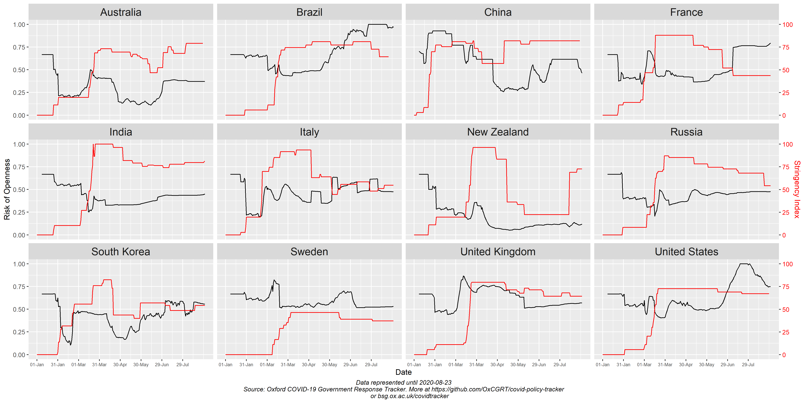
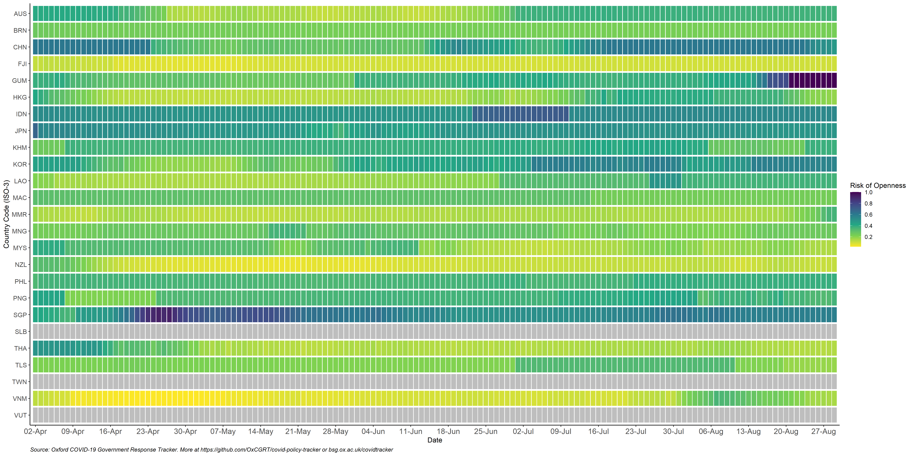
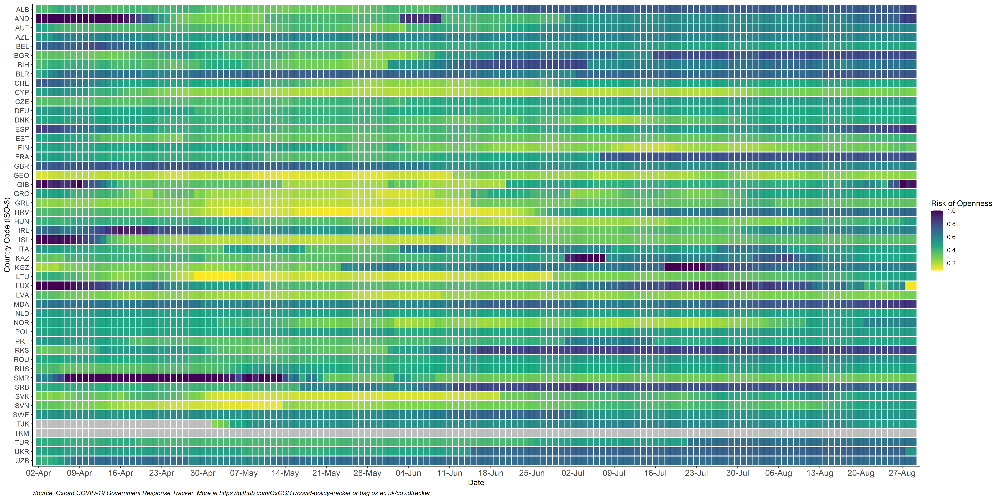
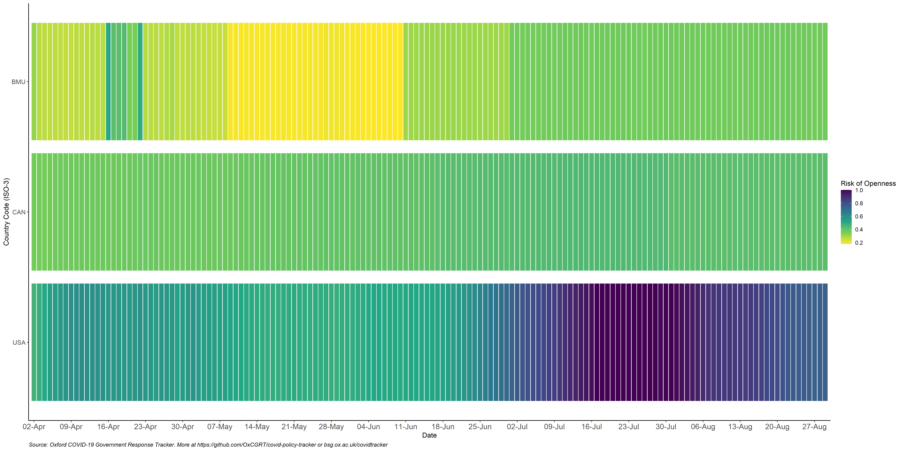
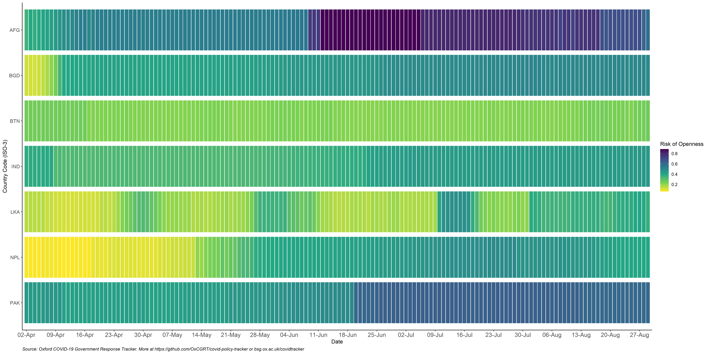
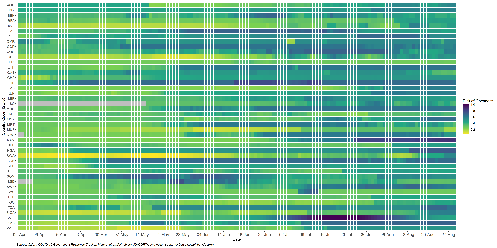
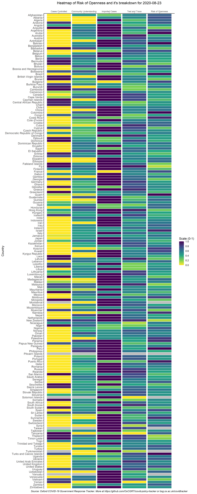
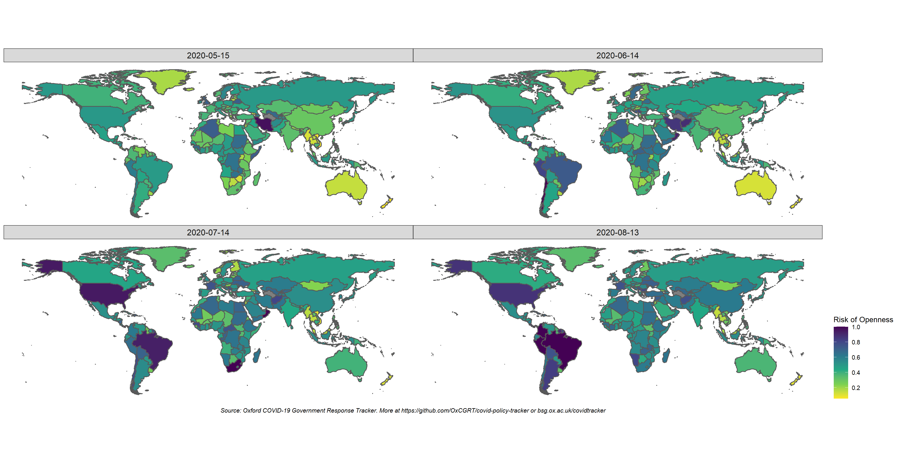

##

# Openness Risk Index 
#### Derived from the Oxford COVID-19 Government Response Tracker 

Since the outbreak of the COVID-19 pandemic, countries have used a wide array of closure and containment policies such as school and workplace closings, travel restrictions, and stay-at-home orders to try to break the chain of infection. They have also rapidly deployed test-trace-isolate procedures to seek to detect and isolate transmission as soon as possible. As the disease has spread around the world, these policies have waxed and waned in many jurisdictions. For example, some have rolled back ‘lockdown’ measures following a reduction in community transmission. Others are seeing a a rise and fall of containment measures as small outbreaks occur. And others still are seeing large surges and responding with agreesive containment policies.  As governments seek to calibrate policy to risk, how and when do they know it is safe to opennen up, and when must they instead close down?

The Oxford COVID-19 Government Response Tracker (OxCGRT) provides a cross-national overview of the risk and response of different countries as they tighten and relax physical distancing measures. The Openness Risk Index (ORI) is based on the recommendations set out by the World Health Organisation’s (WHO) of the measures that should be put in place before Covid-19 response policies can be safely relaxed. Considering that many countries have already started to lift measures, the ORI is a reviewed version of our previous ‘Lockdown rollback checklist’.

While the OxCGRT data cannot say precisely the risk faced by each country, it does provide for a rough comparison across nations. Even this “high level” view reveals that many countries are still facing considerable risks as they ease the stringency of policies.

## Methodology 

Computing risk of opening up isn't straightforward - there's a lot of heterogeniety between countries each of which face different sorts of risk. In April 2020, the WHO [outlined six categories](https://apps.who.int/iris/bitstream/handle/10665/331773/WHO-2019-nCoV-Adjusting_PH_measures-2020.1-eng.pdf) of measures governments need to have in place to diminish the risks of easing measures. For more detail on these, read [here](https://apps.who.int/iris/bitstream/handle/10665/331773/WHO-2019-nCoV-Adjusting_PH_measures-2020.1-eng.pdf). 

OxCGRT currently provides information relevant to three of these recommendations related to: 
* Health capacities and controlling the outbreak 
* Managing the risk of exporting and imported cases
* Community engagement and behaviour change

We combine this with:
* epidemiological data from the European Centre for Disease Control on cases and deaths, provided by [Our World in Data](https://ourworldindata.org/coronavirus), which address recommendation 1
* data collected by Our World in Data on the number of tests conducted in each country, which further addresses recommendation 2
* data from [Apple](https://www.apple.com/covid19/mobility) and [Google](https://www.google.com/covid19/mobility/) on travel and mobility, which further address recommendation 6

From this information, we construct an Openness Risk Index, defined below, which roughly describes the risk of not having closure and containment measures in place, in light of four of the six WHO recommendations. The data is made available in a time series, which makes it possible to see how risk has evolved over time, as the pandemic evolved.

## Brief Overview of the Index Calculation

| WHO Recommendation | Data Sources | Index Calculation 
|--------------------|:------------:|:-----------------:|
| Transmission Controlled|
_No OxCGRT indicators_     Daily cases and Deaths   (from European CDC via Our World in Data) 
|  `cases controlled`  A metric between 0 and 1 based on new cases confirmed each day|
| Test / trace / isolate| 
 OxCGRT: H2 (testing policy)   OxCGRT: H3 (contact tracing policy)     Testing data from Our World in Data 
| `test and trace`   A metric between 0 and 1, half based on testing and contact tracing policy, and half based on the number of tests-per-case a country has conducted (does not measure isolation)|
| Manage risk of exporting and importing cases | OxCGRT: C8 (international travel restrictions) | `manage imported cases`   A metric between 0 and 1 based on the stringency of the country’s restrictions on travel arrivals (does not measure risk of exporting cases)|
|Communities understanding and behaviour change|OxCGRT: H1 (public information campaigns)     Travel and mobility data from Apple and Google     Daily cases and deaths  (from European CDC via Our World in Data) |`community`  A metric between 0 and 1 based on whether a country has a public information campaign and the level of mobility reduction, weighted for current transmission risk.|

### Calculating the Endemic Factor 

Each of the sub-indices are calculated as: 

#### Cases Controlled

#### Testing and Tracing
 

#### Manage imported cases

#### Community

#### Endemic Factor
A country's openness risk isn't completely reflected by the mean of these four indices. In particular, if a country has a very high case count over the past week, we deem it to be 'high risk' to reopening, although this isn't effectively captured by the four indices above (note that cases controlled by itself is a measure to alert for transmission outbreaks in a country). The *endemic factor* acts as a measure of this risk that requires a longer-term control, and is calculated as:

&space;200\\&space;(newcases-50)/150&space;&&space;if&space;&&space;50&space;<&space;newcases-per-million&space;<&space;200&space;\end{matrix}\right." title="EndemicFactor = \left\{\begin{matrix} 0 & if & newcases-per-million < 50\\ 1 & if & newcases-per-million > 200\\ (newcases-50)/150 & if & 50 < newcases-per-million < 200 \end{matrix}\right." />

#### Final Index 
The unadjusted *Openness Risk Index* for the country is calculated as:
   
  
    
 And the final ORI score is calculated as:
    

 

## Visualising the Openness Risk Index

Through ORI visualisations, we hope to interpret three main facets of information: 
* Where are countries placed at present with regard to relaxing Stringency restrictions and the risk they face in doing so? 
* How have countries evolved their Stringency restrictions in the past as opposed to the risk they've faced?

To address the first concern, we produce a line of plots that reflect the scenario in the countries at present. A second set of figures casts a retrospective lens on the evolution of this index over time. 

#### A snapshot of how countries compare on the Openness Risk Index as of the last fortnight. 
_Top Right Quadrant_: High Openness Risk, High Stringency  
_Top Left Quadrant_: Low Openness Risk, High Stringency  
_Bottom Right Quadrant_: __High Openness Risk, Low Stringency__**  
_Bottom Left Quadrant_: Low Openness Risk, Low Stringency  

<!---[Scatter SI vs Rollback](/graphs/summary_scatterSIroll2020-06-28.png)--->

#### A snapshot of how countries compare on the Openness Risk Index over the last quarter.

__Interpretation__: Collective movement across ORI v.s. Stringency space

#### Line plots of Stringency Index and Openness Risk

__Interpretation__: Targeted visualisation of each country's movement across ORI v.s. Stringency space

<!------>

#### Heatmaps of rollback scores of countries over time 

__Interpretation__: Visual cue of a region's ORI evolution  

##### East Asia and Pacific 

##### Europe and Central Asia

##### Latin America and Carribean

##### Middle East and North Africa

##### North America

##### South Asia

##### Sub-Saharan Africa

#### Tile maps of each country's ORI scores    
__Interpretation__: Breakup of each country's most recent score in terms of it's sub-indices  

#### Chloropleth maps of ORI scores over the last quarter
__Interpretation__: Worldwide variation in ORI scores over the past quarter

