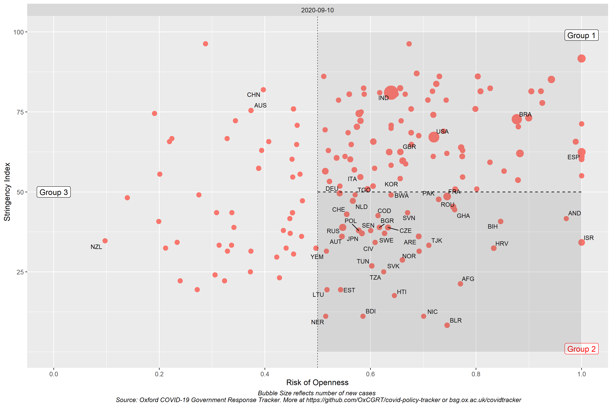
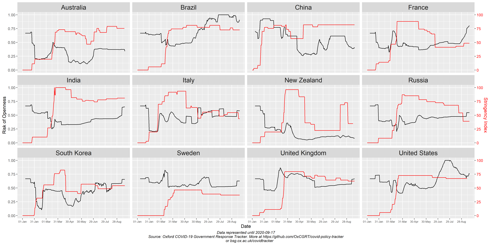
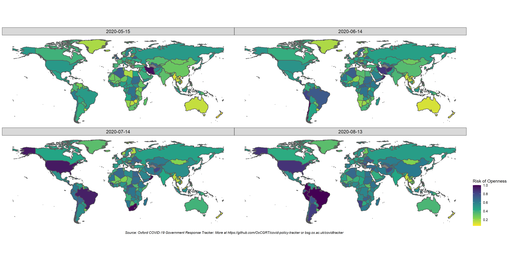
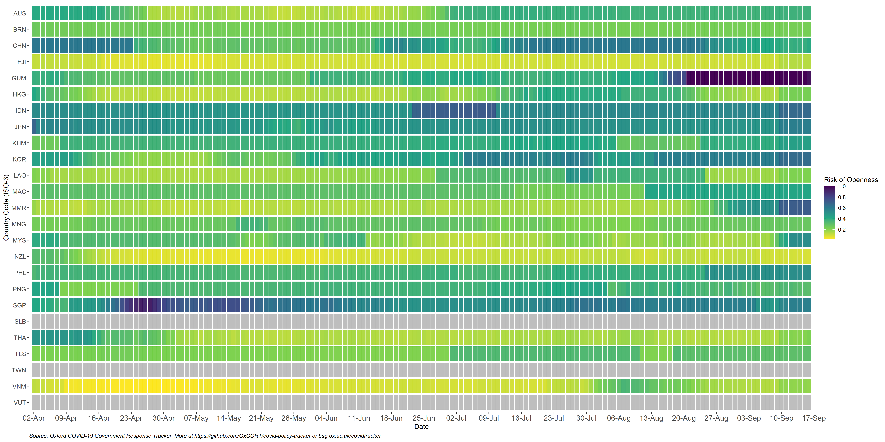
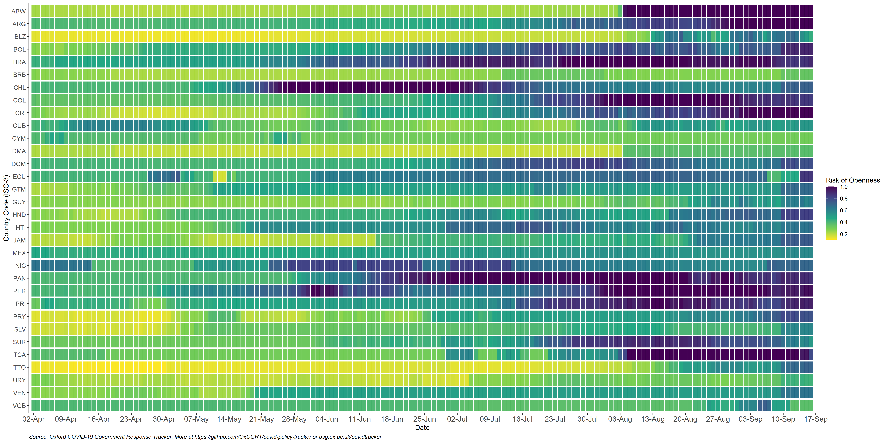
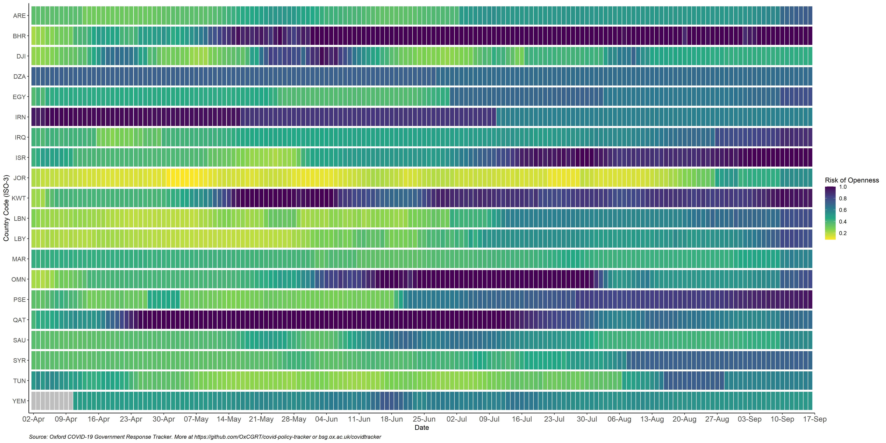
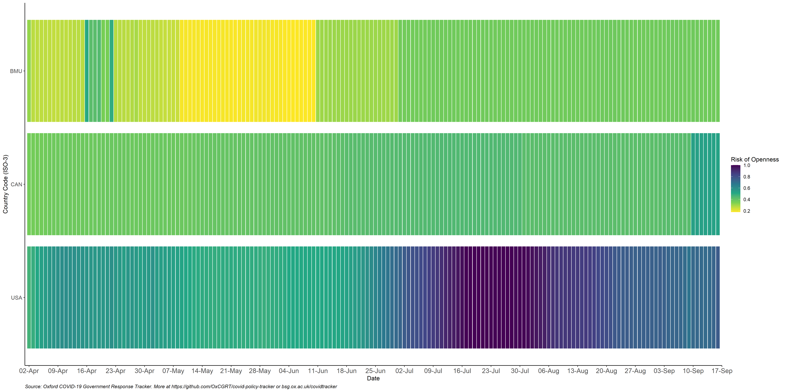
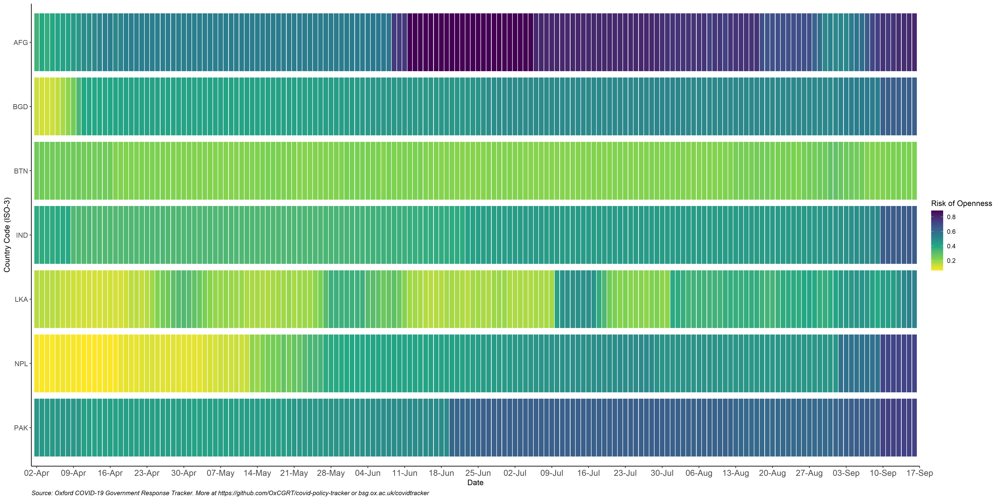
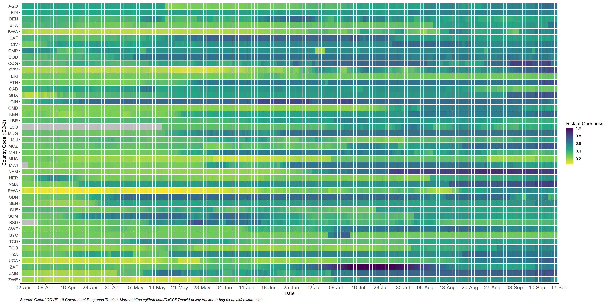

##

# Risk of Openness Index (RoOI)
#### Derived from the Oxford COVID-19 Government Response Tracker (OxCGRT)

Since the outbreak of the COVID-19 pandemic, countries have used a wide array of closure and containment policies such as school and workplace closings, travel restrictions, and stay-at-home orders to try to break the chain of infection. They have also rapidly deployed test-trace-isolate procedures to seek to detect and isolate transmission as soon as possible. As the disease has spread around the world, these policies have waxed and waned in many jurisdictions. For example, some have rolled back ‘lockdown’ measures following a reduction in community transmission. Others are seeing a a rise and fall of containment measures as small outbreaks occur. And others still are seeing large surges and responding with agreesive containment policies.  As governments seek to calibrate policy to risk, how and when do they know it is safe to open up, and when must they instead close down?

The [Oxford COVID-19 Government Response Tracker (OxCGRT)](https://github.com/OxCGRT/covid-policy-tracker) provides a cross-national overview of the risk and response of different countries as they tighten and relax physical distancing measures. The _Risk of Openness Index (RoOI)_ is based on the recommendations set out by the World Health Organisation (WHO) of the measures that should be put in place before Covid-19 response policies can be safely relaxed. Considering that many countries have already started to lift measures, the Risk of Openness Index is a reviewed version of our previous ‘Lockdown rollback checklist’.

While the OxCGRT data cannot say precisely the risk faced by each country, it does provide for a rough comparison across nations. Even this “high level” view reveals that many countries are still facing considerable risks as they ease the stringency of policies.

---

**Cite as:**  
Thomas Hale, Toby Phillips, Anna Petherick, Beatriz Kira, Noam Angrist, Katy Aymar, Sam Webster, Saptarshi Majumdar, Laura Hallas, Helen Tatlow, Emily Cameron-Blake (2020). _Risk of Openness index: When do government responses need to be increased or maintained?_ Blavatnik School of Government.

---

## Methodology 

Computing risk of relaxing stringency measures isn't straightforward - there's considerable risk heterogeneity among countries each of which face risks in different dimensions. In April 2020, the WHO [outlined six categories](https://apps.who.int/iris/bitstream/handle/10665/331773/WHO-2019-nCoV-Adjusting_PH_measures-2020.1-eng.pdf) of measures governments need to have in place to diminish the risks of easing measures. Briefly, the recommendations are: 
1. COVID-19 transmission is controlled to a level of sporadic cases and clusters of cases
2. Sufficient public health workforce and health system capacities are in place
3. Outbreak risks in high-vulnerability settings are minimized
4. Preventive measures are established in workplaces
5. Manage the risk of exporting and importing cases from communities with high risks of transmission
6. Communities are fully engaged (refer [WHO documentation](https://apps.who.int/iris/bitstream/handle/10665/331773/WHO-2019-nCoV-Adjusting_PH_measures-2020.1-eng.pdf) for specifications)  

For more detail on these, read [here](https://apps.who.int/iris/bitstream/handle/10665/331773/WHO-2019-nCoV-Adjusting_PH_measures-2020.1-eng.pdf). This forms the base of our methodology and we model our Risk index to follow WHO recommendations as closely as possible. Since this is an evolving base, we expect to make 
changes to our methodology upon updates to the official WHO recommendations.  

OxCGRT currently provides information relevant to three of the six recommendations related to: 
* _Health capacities and controlling the outbreak_ (Recommendation 2) 
* _Managing the risk of exporting and imported cases_ (Recommendation 5)
* _Community engagement and behaviour change_ (Recomendation 6)

We combine this with:
* epidemiological data from the [European Centre for Disease Prevention and Control (ECDC)](https://www.ecdc.europa.eu/en/publications-data/download-todays-data-geographic-distribution-covid-19-cases-worldwide) and [John Hopkins University CSSE COVID-19 Data Repository](https://github.com/CSSEGISandData/COVID-19) on cases and deaths, which provides information related to __Recommendation 1__
* data collected by [Our World in Data](https://raw.githubusercontent.com/owid/covid-19-data/master/public/data/testing/covid-testing-all-observations.csv) on the number of tests conducted in each country, which addresses __Recommendation 2__
* data from [Apple](https://www.apple.com/covid19/mobility) and [Google](https://www.google.com/covid19/mobility/) on travel and mobility, which we use to address __Recommendation 6__

From this information, we construct a _Risk of Openness Index (RoOI)_, defined below, which roughly describes the risk of not having closure and containment measures in place, in light of four of the six WHO recommendations. The data is made available in a time series, which makes it possible to see how risk has evolved over time, as the pandemic evolved.

__Which WHO recommendations are not captured by OxCGRT Risk Index?__  
The two recommendations OxCGRT is unable to track/find reliable data on are: 
* Outbreak risks in high-vulnerability settings are minimized
* Preventive measures are established in workplaces 

The Methodology will be updated if we are able to track these recommendations using secondary data sources, or in a representative manner through our own data. 

## Brief Overview of the Index Calculation

The detailed calculations and logic behind the formulae are in the Risk of Openness Index Working Paper, but the updated and version controlled source is the [methodology documentation](./methodology.md). The table below provides a brief description of the calculation for each 
of the sub-indices that constitute the Risk index. 

| WHO Recommendation | Data Sources | Sub-Index Description | 
|--------------------|:------------|:-----------------|
| Transmission Controlled|
_No OxCGRT indicators_     Daily cases and Deaths   (from [European CDC via Our World in Data](https://opendata.ecdc.europa.eu/covid19/casedistribution/) and [John Hopkins University CSSE COVID-19 Data Repository](https://github.com/CSSEGISandData/COVID-19)) 
|  `cases controlled`  A metric between 0 and 1 based on new confirmed cases each day|
| Test / trace / isolate| 
 OxCGRT: H2 (testing policy)   OxCGRT: H3 (contact tracing policy)     [Testing data from Our World in Data](https://raw.githubusercontent.com/owid/covid-19-data/master/public/data/testing/covid-testing-all-observations.csv) 
| `test and trace`   A metric between 0 and 1, half based on testing and contact tracing policy, and half based on the number of tests-per-case a country has conducted (does not measure isolation)|
| Manage risk of exporting and importing cases | OxCGRT: C8 (international travel restrictions) | `manage imported cases`   A metric between 0 and 1 based on the stringency of the country’s restrictions on travel arrivals (does not measure risk of exporting cases)|
|Communities understanding and behaviour change|OxCGRT: H1 (public information campaigns)     Travel and mobility data from [Apple](https://www.apple.com/covid19/mobility) and [Google](https://www.google.com/covid19/mobility/)     Daily cases and deaths  (from [European CDC via Our World in Data](https://www.ecdc.europa.eu/en/publications-data/download-todays-data-geographic-distribution-covid-19-cases-worldwide)) |`community`  A metric between 0 and 1 based on whether a country has a public information campaign and the level of mobility reduction, weighted for current transmission risk.|

### Endemic Factor 

A country's risk of openness isn't completely reflected by the mean of these four sub-indices. In particular, if a country has a very high level of transmission over the past week, we deem it to be 'high risk' to reopening, although this isn't effectively captured by the four indices above. Note that cases controlled by itself is a measure to alert for transmission outbreaks in a country; it reaches maximum risk at relatively low levels (50 new cases per day) and does not give an indication of countries where the virus is truly endemic. The __endemic factor__ acts as a measure of this risk where there are not just a handful of new cases, but rather population-scale transmission. When this is the case, it effectively creates a ‘floor’ on the risk level no matter how good the other sub-components are. The endemic factor is a measure between 0 and 1, and depends on the total number of new cases in a country, proportioned by population.  

### Calculations 

All calculations performed for the sub-indices, endemic factor and the final index are detailed in the [methodology documentation](./methodology.md).

## Using the Risk of Openness Index 

### Availability
Risk of Openness Index data is represented in a longitudinal format with unique country-date index values. The country identifiers are ISO-3 countrycodes, which can be used as merge identifiers for joins with [OxCGRT National Indicators dataset](https://github.com/OxCGRT/covid-policy-tracker). The data is 
presented in a CSV format in [/data/riskindex_timeseries_latest.csv](./data/riskindex_timeseries_latest.csv). The data and it's associated plots will be updated on a daily basis.  

### Quality
Since a key data dependency is the OxCGRT Database, the general conditions around data quality relevant to OxCGRT apply here as well. Read more about these [here](https://github.com/OxCGRT/covid-policy-tracker#data-quality).  

Note also that by definition, a 'Risk of Openness' is undefined until a country observes any cases and implements containment policies. Therefore, the Risk Index timeseries for a country only starts when its confirmed cases count exceeds 0, until which it is defined as `NA`.  

Additionally, since the testing and mobility data dependencies themselves often have gaps (eg. no testing or mobility data on certain dates), there are measures taken to impute missing values with best approximations. See [methodology documentation](./methodology.md) for the latest calculation on `NA` handling or Technical Appendix A in the working paper for more details on this. 

## Visualising the Risk of Openness Index  

A key objective of the Risk of Openness Index is to observe the stances in policy when faced with a certain ordinal risk measure, and the evolution of this stance over time compared to the evolution of the risk measure. We use the Stringency Index to map government containtment policy, although other [OxCGRT Indices](https://github.com/OxCGRT/covid-policy-tracker#policy-indices) could be appropriate based on the context of the response being observed.  

Through Risk Index visualisations, we hope to interpret two main facets of information: 
* Where are countries placed **at present** with regard to relaxing Stringency restrictions and the risk they face in doing so? 
* How have countries evolved their Stringency restrictions **in the past** given the contemporaneous risk observed?

To address the first concern, we produce a line of plots that reflect the scenario in the countries at present. A second set of figures casts a retrospective lens on the evolution of this index over time. 

#### A snapshot of how countries compare on the Risk of Openness Index as of the last fortnight. 
_Top Right Quadrant (Group 1)_: High Risk of Openness, High Stringency  
_Bottom Right Quadrant (__Group 2__)_: __High Risk of Openness, Low Stringency__**  
_Top Left Quadrant (Group 3)_: Low Risk of Openness, High Stringency  
_Bottom Left Quadrant (Group 3)_: Low Risk of Openness, Low Stringency  

For more information about the interpretations of the Groups with regard to policy stances, see working paper. 

<!---[Scatter SI vs Rollback](/graphs/summary_scatterSIroll2020-06-28.png)--->

#### A snapshot of how countries compare on the Risk of Openness Index over the last quarter.

__Interpretation__: Collective movement across Risk of Openness v.s. Stringency space

#### Line plots of Stringency Index and Risk of Openness

__Interpretation__: Targeted visualisation of each country's movement across Risk of Openness v.s. Stringency space

<!------>

#### Choropleth maps of Risk Index scores over the last quarter
__Interpretation__: Worldwide variation in Risk Index scores over the past quarter

#### Heatmaps of Risk Index indices of countries over time 

__Interpretation__: Visual cue of a region's Risk Index evolution  

##### East Asia and Pacific 

##### Europe and Central Asia

##### Latin America and Carribean

##### Middle East and North Africa

##### North America

##### South Asia

##### Sub-Saharan Africa

#### Heatmap of each country's Risk Index scores    
__Interpretation__: Breakup of each country's most recent score in terms of it's sub-indices  

*This is a project from the [Blavatnik School of Government](https://github.com/OxCGRT/covid-policy-tracker/blob/master/www.bsg.ox.ac.uk). More information on the OxCGRT is available on the school's website: https://www.bsg.ox.ac.uk/covidtracker.*
